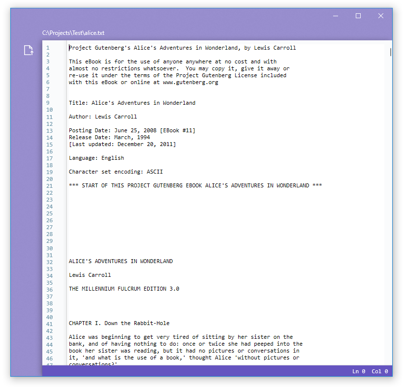

# XiUWP
Super cool UWP app using the Xi-Editor (https://github.com/google/xi-editor)

## Features

* Extremely fast: powered by Xi
* Modern: Fluent design with beautiful cleartype rendered text
* Great for people who also like the color purple
* Uses 60% less RAM than any Electron app
